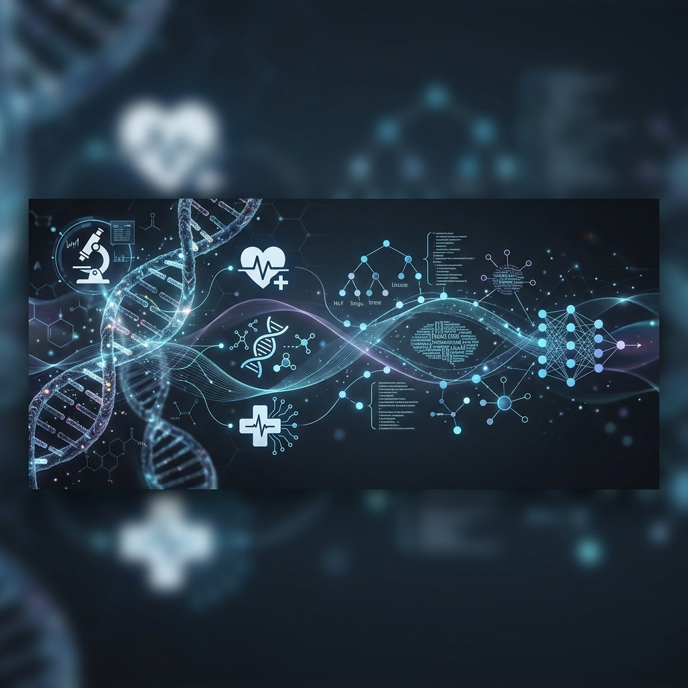
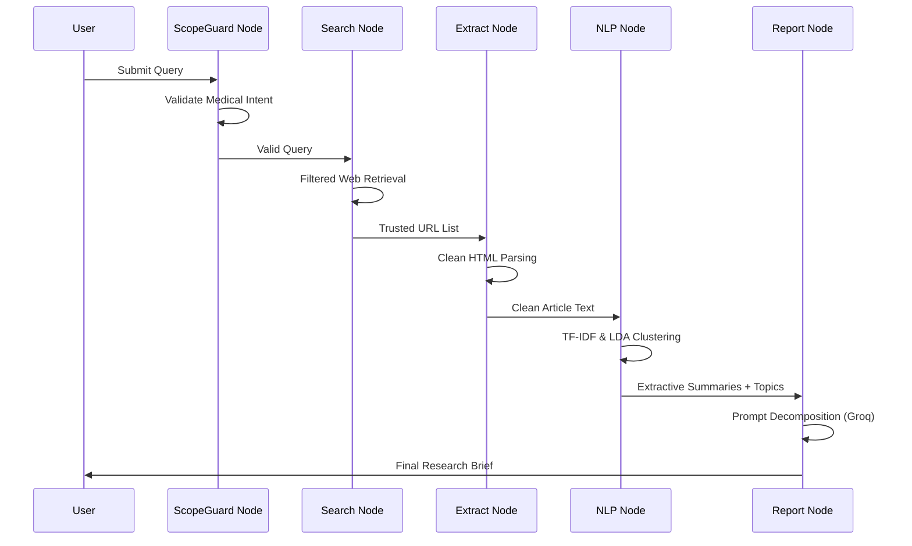
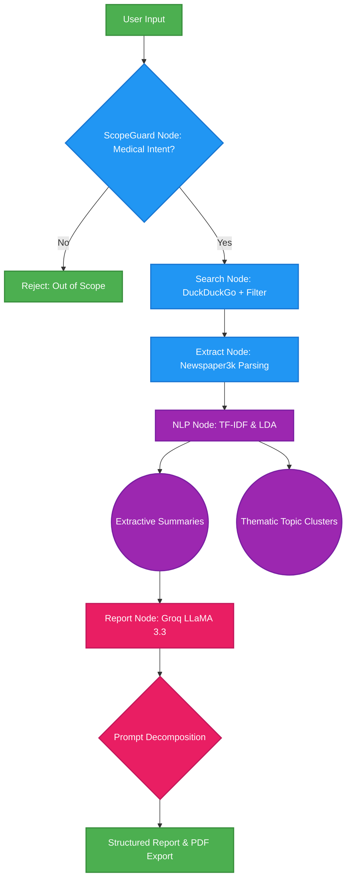

# ResearchScope AI: Agentic Healthcare Research Assistant



## 🩺 Project Overview
**ResearchScope AI** is a state-of-the-art, agentic academic research assistant designed to automate the retrieval, analysis, and synthesis of medical research data. Traditional research is often hindered by information overload; ResearchScope solves this by utilizing an autonomous **LangGraph-based** architecture that orchestrates a multi-stage pipeline of data retrieval, mathematical NLP analysis, and generative intelligence.

Unlike generic LLM wrappers, ResearchScope is built on a "Logic First" principle. It uses **Classical NLP** (TF-IDF and LDA) to pre-process and anchor all findings in mathematical evidence before utilizing a Large Language Model for synthesis, ensuring high academic integrity and reducing the risk of hallucinations.

---

## 🚀 Key Innovations & Features

### 1. Agentic Workflow (LangGraph)
- **Autonomous Execution**: Manages the research lifecycle through a robust node-based state machine.
- **ScopeGuard Security**: A deterministic intent-classifier that verifies medical context before processing, ensuring safe and domain-restricted results.

### 2. Explainable AI & Interactive Walkthrough
- **Pipeline Transparency**: A unique "Step-by-Step" UI mode that allows researchers to visually follow the data as it moves from raw URLs to NLP clusters to the final report.
- **Educational Layer**: Explains the underlying theory (RAG, TF-IDF, LDA) as it executes, fostering trust in the system's output.

### 3. Rigorous Analytical Engine
- **TF-IDF Vectorization**: Uses statistical weights to score and extract the most important sentences directly from peer-reviewed sources.
- **LDA Topic Modeling**: Employs Latent Dirichlet Allocation to discover underlying thematic clusters across the returned research corpus.

### 4. High-Performance Synthesis
- **Groq LPU Acceleration**: Utilizes the Groq API (LLaMA 3.3 Versatile) for ultra-low latency inference.
- **Prompt Decomposition**: Breaks down complex report generation into localized tasks (Abstract, Findings, Conclusion) for maximum detail retention.

### 5. Professional Export
- **PDF Generation**: Dynamic on-the-fly markdown-to-PDF rendering for offline research archiving.

---

## 🛠️ System Architecture

### Pipeline Transition: Milestone 1 to Milestone 2
The system evolved from a linear script (Milestone 1) into a fully autonomous agentic graph (Milestone 2).

**Agent Sequence Diagram:**


**Architecture Flow:**


---

## 📊 Analytical Insights

### Unsupervised Topic Discovery (LDA)
The system automatically identifies latent thematic drivers across the research corpus. Below is a conceptual representation of how data is clustered:

| Cluster ID | Sample Key Terms | Thematic Interpretation |
| :--- | :--- | :--- |
| **01** | *Detection, Imaging, Cancer, Diagnosis* | Early Diagnostic Methodologies |
| **02** | *Treatment, Protocol, Clinical, Trials* | Therapeutic Interventions |
| **03** | *Prevention, Public Health, WHO* | Epidemiological Strategies |

### TF-IDF Statistical Anchoring
Every sentence in the final summary is selected based on its **TF-IDF Score**, ensuring that the generated overview is statistically representative of the source papers rather than a generic hallucination.

---

## 💻 Technology Stack

| Layer | Technology |
| :--- | :--- |
| **Agent Orchestration** | LangGraph |
| **Generative Brain** | Groq API (LLaMA 3.3 Versatile) |
| **User Interface** | Streamlit |
| **NLP Engine** | NLTK, Scikit-Learn (TF-IDF, LDA) |
| **Content Retrieval** | DuckDuckGo Search, Newspaper3k |
| **Reporting Tool** | FPDF |
| **CI/CD** | GitHub Actions, Flake8 |

---

## ⚙️ Execution Guide

1. **Environment Setup**
   ```bash
   git clone https://github.com/AradhyaTiwari10/researchscope-nlp-healthcare.git
   cd researchscope-nlp-healthcare
   python -m venv venv
   source venv/bin/activate
   pip install -r requirements.txt
   ```

2. **API Configuration**
   Create a `.env` file and add your Groq API Key:
   ```env
   GROQ_API_KEY="your_key_here"
   ```

3. **Launch the Dashboard**
   ```bash
   streamlit run app.py
   ```

---

## 👥 The Research Team
* **Aradhya Tiwari** - Lead Architect
* **Sahil Chand** - NLP Specialist
* **Aaryan Krishna** - Backend & Integration
* **Vivek Kumar Raj** - UI/UX Design

---

## 📑 Acknowledgements
This project is submitted as a final Year Capstone Project. It demonstrates a commitment to building Explainable, Ethical, and Scalable AI for the healthcare sector.
