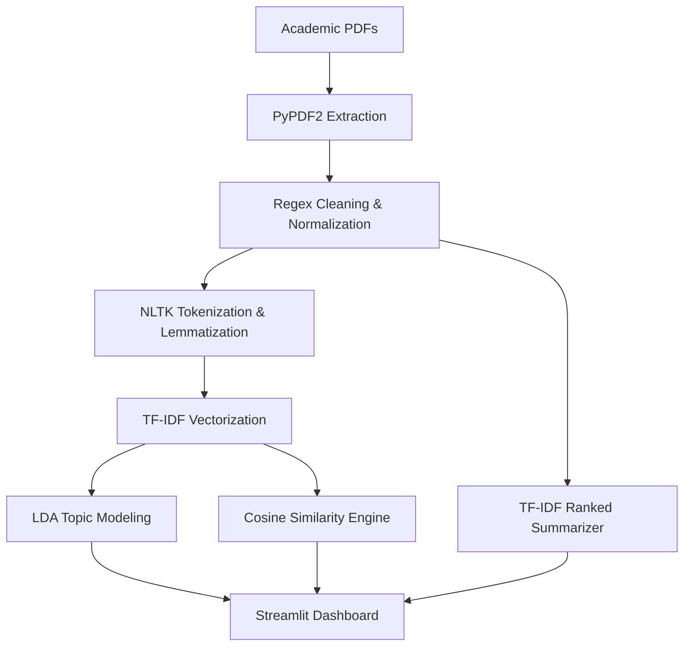

# ResearchScope NLP Healthcare: AI-Driven Research Analysis System


## 🩺 Project Overview
**ResearchScope NLP Healthcare** is an advanced AI-driven analytics system designed to bridge the gap between massive academic corpuses and actionable research insights. In the rapidly evolving healthcare sector, researchers are inundated with thousands of papers across genomics, clinical medicine, and predictive analytics. This system automates the ingestion, cleaning, and thematic analysis of these documents using mathematically rigorous **Classical NLP** techniques.

By leveraging probabilistic models and statistical vectorization, ResearchScope transforms unstructured PDF data into structured thematic clusters, cross-document similarity heatmaps, and concise extractive summaries—all without the "black-box" nature of Large Language Models.

---

## 🚀 Key Features

### 1. Intelligent PDF Ingestion & Preprocessing
- **Automated Extraction**: Robust text extraction from multi-column academic PDFs using `PyPDF2`.
- **Regex-Based Noise Reduction**: Custom cleaning pipeline to remove scientific metadata artifacts:
  - **Ligature & Hyphenation Repair**: Normalizes multi-character ligatures (e.g., "fi", "ffl") and repairs words broken across lines.
  - **Entity Filtering**: Removes DOIs, URLs, Email addresses, and all-caps section headers.
  - **Citation Removal**: Automatically strips citation markers like `[15]` or `(2021)`.
- **Lemmatization & Normalization**: NLTK-powered WordNet lemmitizer to ensure semantic consistency (e.g., "diagnosing", "diagnosed", and "diagnosis" are unified).

### 2. Probabilistic Topic Discovery (LDA)
- Employs **Latent Dirichlet Allocation** to identify latent thematic drivers across the corpus.
- Automatically groups papers into high-level categories such as *Genomics*, *Clinical Risk Prediction*, and *Sensor-based Diagnostics*.
- Provides a "Reliability Score" for each document's mapping to its dominant topic.

### 3. Cross-Document Similarity Analysis
- Uses **TF-IDF (Term Frequency-Inverse Document Frequency)** for robust vectorization.
- Generates a **Cosine Similarity Matrix** to measure the "mathematical distance" between research papers.
- Discover redundant findings or identify highly related works through interactive heatmaps.

### 4. Smart Extractive Summarizer
- Ranks sentences within the Abstract and Introduction based on TF-IDF weighting.
- Sequences the top 3 high-impact sentences to provide a coherent "cliff-notes" version of the research methodology and findings.

### 5. Interactive Dashboard
- A sleek **Streamlit** UI for researchers to upload papers in real-time or explore our pre-loaded demo corpus of 10 seminal healthcare AI papers.

---

## 🛠️ System Architecture



---

## 💻 Technology Stack

| Layer | Technology |
| :--- | :--- |
| **User Interface** | Streamlit |
| **NLP Core** | NLTK, Scikit-Learn |
| **Data Processing** | Pandas, NumPy, Regex |
| **Feature Engineering** | TF-IDF, WordNet |
| **Visualization** | Matplotlib, Seaborn, WordCloud, Altair |
| **File Handling** | PyPDF2 |

---

## 📈 Milestones & Roadmap

### ✅ Milestone 1: Classical NLP Pipeline (Current)
- [x] PDF text extraction and robust preprocessing.
- [x] Feature engineering via TF-IDF.
- [x] Topic Modeling using LDA.
- [x] Cosine Similarity Heatmaps.
- [x] Extractive Summarization engine.
- [x] Functional Streamlit local & cloud dashboard.

### 🔮 Milestone 2: Agentic Research Assistant
- [ ] **Agentic Reasoning**: Integrating LangGraph for autonomous research exploration.
- [ ] **RAG Implementation**: Vector storage using Chroma/FAISS for deep-context retrieval.
- [ ] **Structured Insight Reports**: Generating PDF/Markdown research briefs.

---

## ⚙️ Installation & Setup

1. **Clone the Repository**
   ```bash
   git clone https://github.com/AradhyaTiwari10/researchscope-nlp-healthcare.git
   cd researchscope-nlp-healthcare
   ```

2. **Set up Virtual Environment**
   ```bash
   python -m venv venv
   source venv/bin/activate  # Mac/Linux
   ```

3. **Install Dependencies**
   ```bash
   pip install -r requirements.txt
   ```

4. **Run the Application**
   ```bash
   streamlit run app.py
   ```

---

## 👥 The Team
This project was developed by:
* **Aradhya Tiwari**
* **Sahil Chand**
* **Aaryan Krishna**
* **Vivek Kumar Raj**

---

## 📄 License & Disclaimer
*This project is built for academic research analysis. All data processed is from publicly available peer-reviewed papers. The system is designed for interpretability and does not use LLMs for its core logic.*

